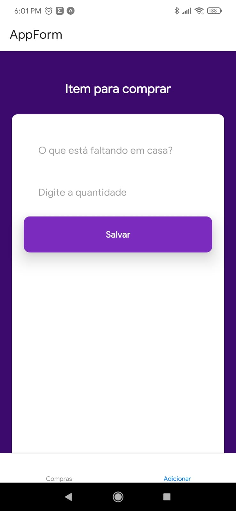
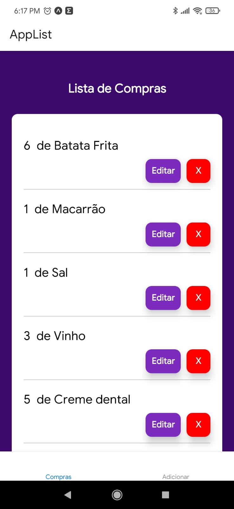

# LisTagem de Compras

Este projeto foi desenvolvido para praticar realizando a inserção, atualização e remoção de dados react-native

## Projeto Lista e Compras

Esta aplicação permite que usuários gerenciem suas listas de compras, podendo adicionar, editar e excluir produtos

## Tecnologias

Este projeto foi desenvolvido com as seguintes tecnologias:

- [React Native](https://reactnative.dev/)
- [JavaScript](https://developer.mozilla.org/pt-BR/docs/Web/JavaScript)
- [CSS](https://developer.mozilla.org/pt-BR/docs/Web/CSS)

<br>
                                                     
## Demonstração

<br>

### Tela Inicial

<br>

Nesta tela é realizado a inserção de produtos, ela é composta por inputs para inserir
a descrição do produto e a quantidade, na parte inferior fica as abas "adicionar" ou "compras" que é onde verifica sua lista de compras.
<br>
<br>
 



### Tela de Compras

<br>

Após realizar o cadastro, o sistema irá redirecionar para a tela de compras, onde mostra os produtos inseridos, o usuário pode editar ou remover o produto.
<br>
<br>
 



<br>


## Como usar

```
# Clone este repositório
$ git clone https://github.com/marlenesedano/lista_compras_react_native_crud.git

# Acesse o diretório do projeto
$ cd lista_compras_react_native_crud-master

# Instale as dependências
$ yarn install


# Inicie a aplicação
$ yarn start

# O site vai estar disponível na porta 19000 
```

